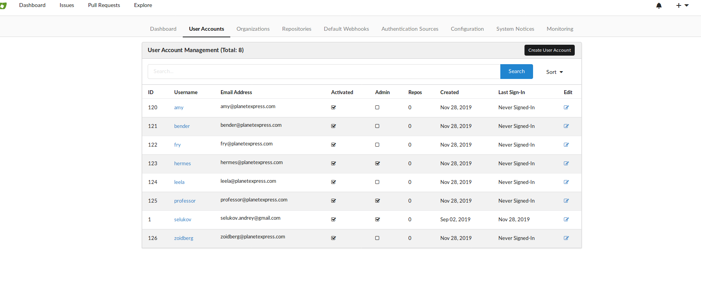
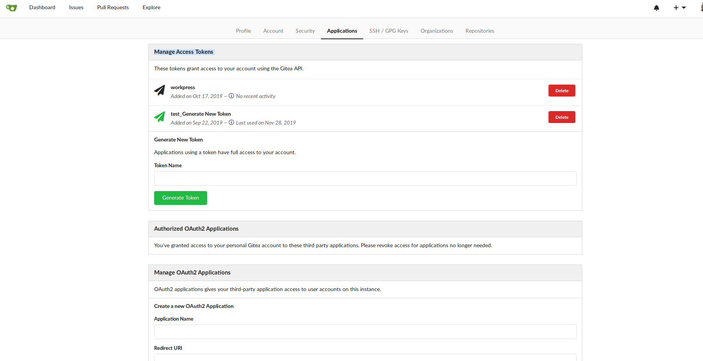
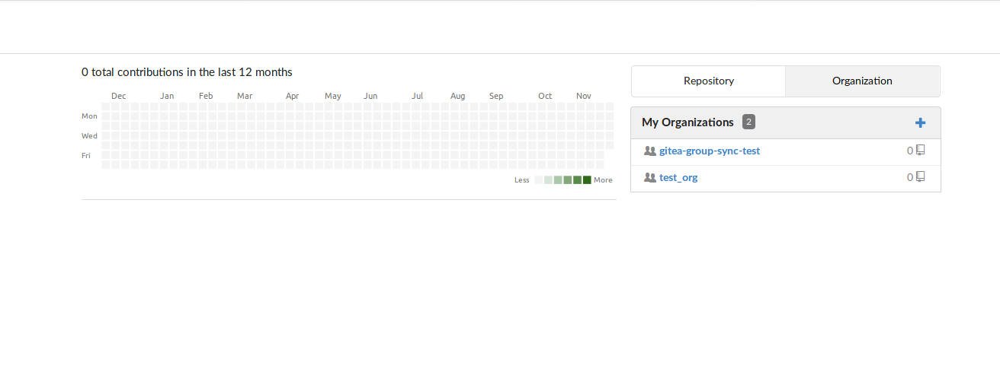
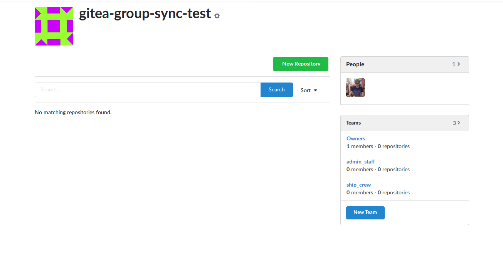
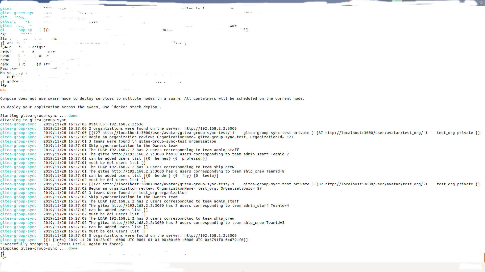
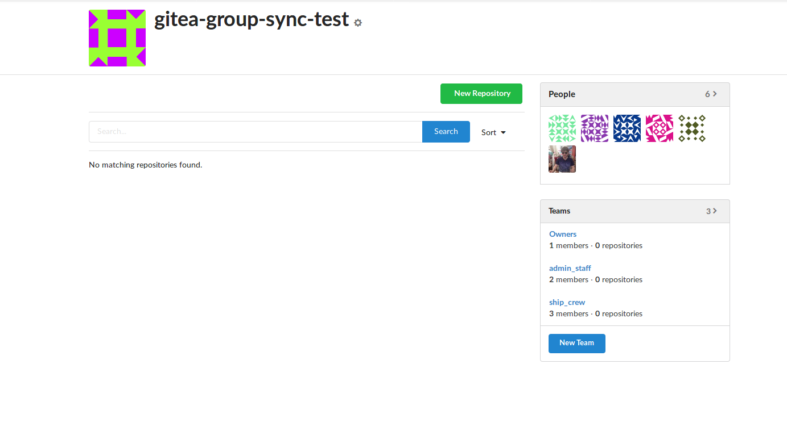
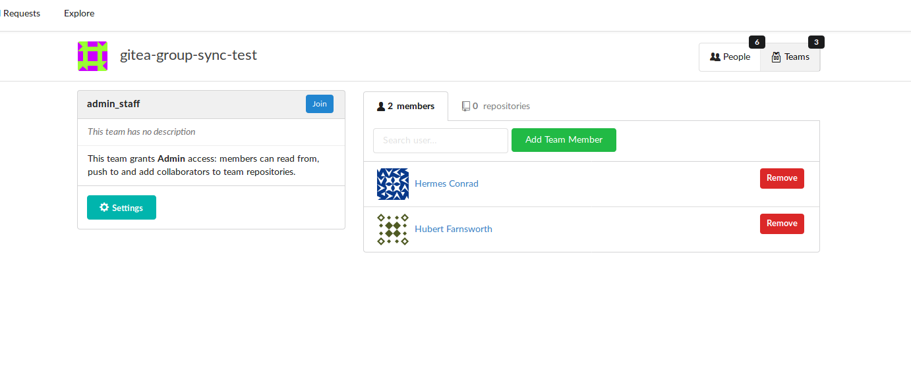
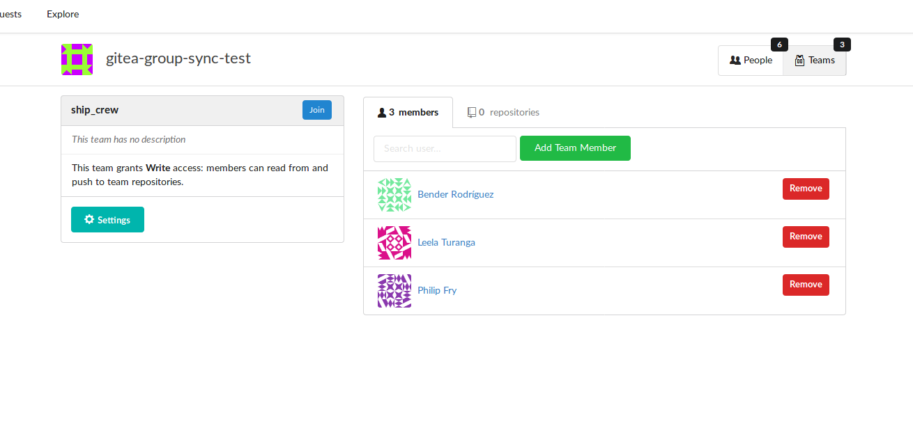

# Gitea Group Sync

This application adds users to appropriate teams in Gitea based on group membership information in LDAP.

## Installation instructions

You must have configured your LDAP with gitea

Here I will give the settings for a simple [LDAP](https://github.com/rroemhild/docker-test-openldap), you can configure by changing the code as you like

If you configured the [Gitea](https://hub.docker.com/r/gitea/gitea) <=> [LDAP](https://github.com/rroemhild/docker-test-openldap) connection correctly, you should have users



You need to create Manage Access Tokens and add key to run.sh or docker-compose.yml the configuration file

##### Configuration: 
There are two ways to configure the application. Via YAML Configuration File or Enviroment Variables. 
- See `run.sh` for an example using the enviroment Variables. 
- Use `./gitea-group-sync --config="config.yaml"` with the example Config File for the YAML Variant.

##### Gitea Tokens
The application supports several keys, since to add people to the group you must be the owner of the organization.




#### create organizations in gitea



#### add the appropriate groups in our case: ship_crew, admin_staff



### Usage


REP_TIME: '@every 1m'  -- you can change the synchronization time of groups 


```
docker-compose up
```

or

```
./run.sh
```



### Realise





